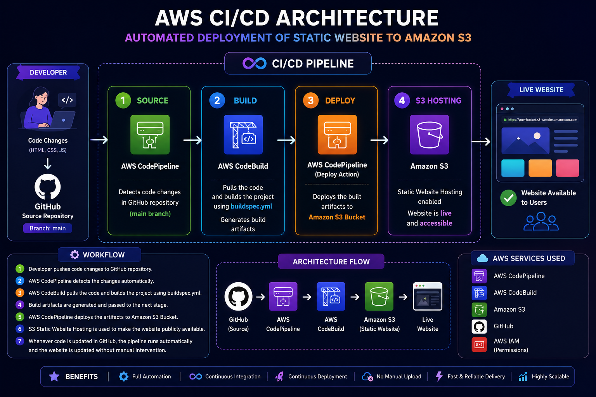
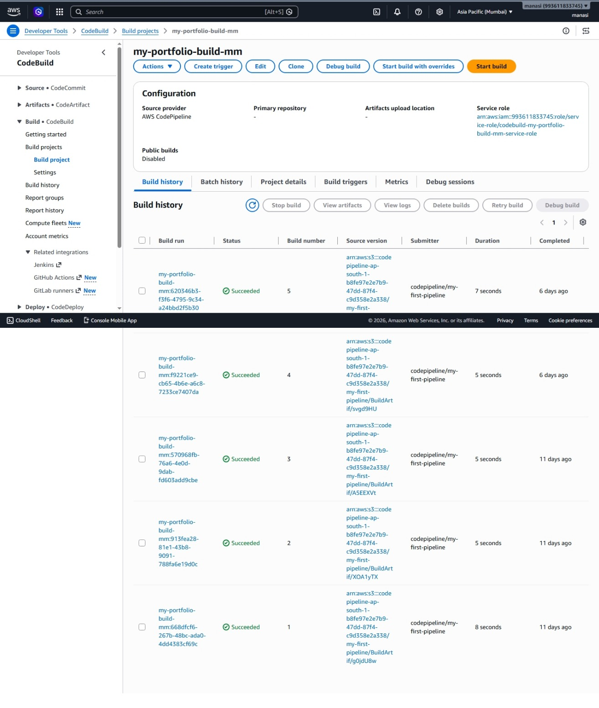
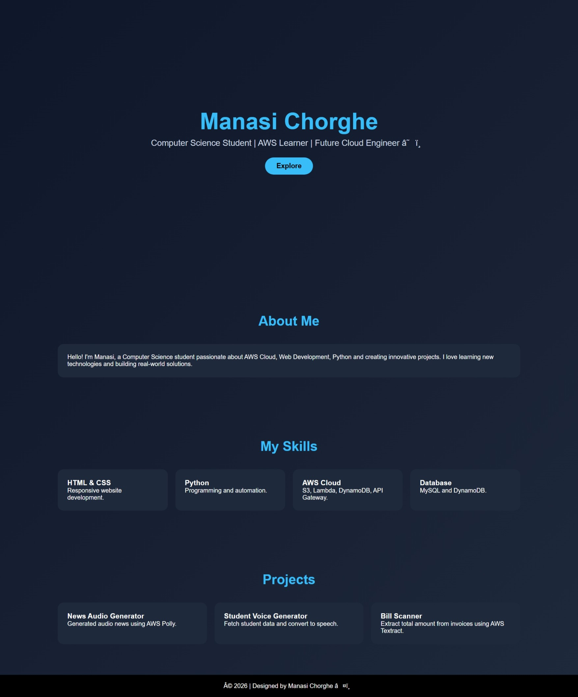

# 🚀 AWS DevOps CI/CD Pipeline for Automated Static Website Deployment

## 📌 Project Overview

This project demonstrates an automated CI/CD deployment workflow using AWS services.

The main goal of this project is to automatically deploy a static website to Amazon S3 whenever code changes are pushed to GitHub.

No manual file upload is required. The complete deployment process is automated using AWS CodePipeline and CodeBuild.

---

# 🏗️ Architecture
Developer
|
|
GitHub Repository
|
|
AWS CodePipeline
|
|
AWS CodeBuild
|
|
Amazon S3 Static Website Hosting
|
|
Live Website

---

# ☁️ AWS Services Used

## 1. GitHub
- Stores source code
- Triggers pipeline when changes are pushed

## 2. AWS CodePipeline
- Automates the CI/CD workflow
- Detects changes from GitHub
- Manages build and deployment stages

## 3. AWS CodeBuild
- Builds the project automatically
- Uses buildspec.yml configuration
- Generates deployment artifacts

## 4. Amazon S3
- Hosts the static website
- Receives updated files automatically
- Provides public website access

## 5. AWS IAM
- Provides required permissions between AWS services

---

# ⚙️ CI/CD Workflow

### Step 1: Code Changes

Developer modifies website files:

- HTML
- CSS
- JavaScript

Changes are pushed to GitHub repository.

⬇️

### Step 2: Source Stage

AWS CodePipeline detects the latest GitHub changes automatically.

⬇️

### Step 3: Build Stage

AWS CodeBuild starts the build process using:
buildspec.yml

⬇️

### Step 4: Deploy Stage

The generated files are deployed automatically to Amazon S3 bucket.

⬇️

### Step 5: Website Update

The latest version of the website becomes available instantly.

---

# 📸 Project Screenshots

## 🔹 AWS Architecture Diagram

## 🔹 CodePipeline Successful Execution

## 🔹 CodeBuild Successful Build

## 🔹 Live Website Hosted on Amazon S3

---

# 📂 Project Files
index.html

Frontend website file
buildspec.yml

AWS CodeBuild configuration file
images/

Project execution screenshots

---

# ✨ Key Features

✅ Fully automated deployment  
✅ Continuous Integration & Continuous Deployment  
✅ No manual S3 upload required  
✅ GitHub based source control  
✅ AWS managed CI/CD workflow  
✅ Fast and reliable deployment  

---

# 🎯 Advantages

- Reduces manual deployment errors
- Saves development time
- Provides continuous delivery
- Automatically updates website after code changes

---

# 🔄 Future Improvements

- Add CloudFront for faster global delivery
- Add custom domain using Route 53
- Add HTTPS certificate using AWS Certificate Manager
- Add monitoring using CloudWatch

---
This project demonstrates DevOps automation using AWS CI/CD services.
